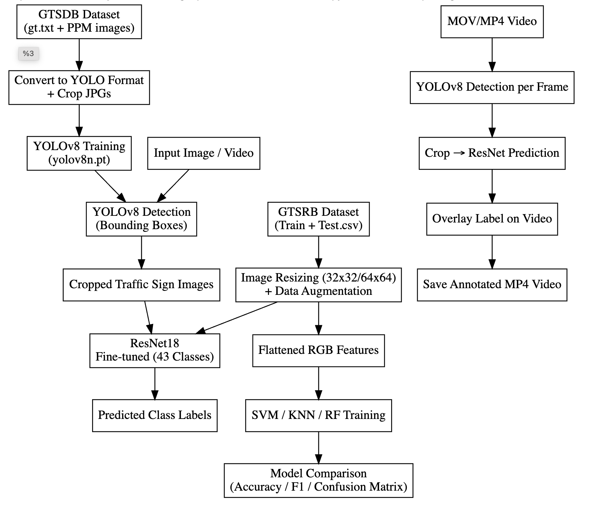
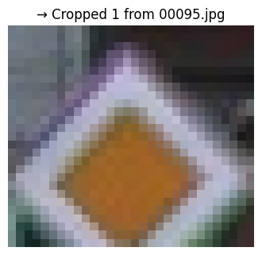
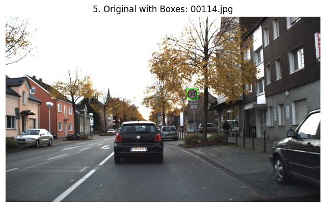

# Traffic-Sign-Detection-and-Recognition
A two-stage pipeline for detecting and classifying traffic signs using YOLOv8 and ResNet18, tested on benchmark datasets and real-world video.
---

## 📝 Project Overview

This project implements a **traffic sign detection and classification pipeline** using state-of-the-art deep learning models. It is designed for educational and research purposes and tested on real-world data.

### Detection Stage
- **Model:** YOLOv8  
- **Dataset:** GTSDB 
- **Function:** Detects traffic signs in images or video frames.

### Classification Stage
- **Model:** ResNet18  
- **Dataset:** GTSRB  
- **Function:** Classifies cropped traffic signs into correct categories.

---

## 🎯 Key Features

- Two-stage pipeline: **Detection → Classification**  
- Automatically downloads datasets from Google Drive if not present locally  
- Tested on a **manually recorded video**, showing real-world performance

---

## Datasets

- The datasets are publicly available on **Google Drive**:  
  - **GTSRB:** [Drive link](https://drive.google.com/file/d/1HfmPX_O19iyQoxHphYY7XHOyvbeyKbAh/view?usp=sharing)  
  - **GTSDB:** [Drive link](https://drive.google.com/file/d/13JIMRCWMdDMK-LloLTm3qWyonfkjA09b/view?usp=sharing)  

- Kaggle links for accessing the datasets directly:  
  - **GTSRB:** [Kaggle link](https://www.kaggle.com/datasets/meowmeowmeowmeowmeow/gtsrb-german-traffic-sign)  
  - **GTSDB:** [Kaggle link](https://www.kaggle.com/datasets/safabouguezzi/german-traffic-sign-detection-benchmark-gtsdb)  

- **Note:** In the code, the datasets are already loaded from Google Drive, so there is no need to download them manually.

## 📈 Overall Workflow

This diagram illustrates the complete process, from input to final output.

**Main Steps:**
1.  **Input:** An image containing various traffic signs.
2.  **Detection:** Finding the location (bounding box) of each traffic sign.
3.  **Extraction:** Cropping each detected sign from the main image.
4.  **Classification:** Identifying the specific type of each cropped sign.
5.  **Output:** The final image with all signs detected and labeled.

## Traffic Sign Detection Workflow

  

*(A flowchart showing the entire process from input to output.)*

## 🎯 Stage 1: Traffic Sign Detection

In this stage, the model's task is to find the precise location of traffic signs in an image and draw a bounding box around them.

* **Model Used:** YOLO (You Only Look Once)
* **Dataset:** GTSDB (German Traffic Sign Detection Benchmark)
* **Process:** The YOLO model scans the input image and accurately identifies the position of every traffic sign present.

<table align="center">
 <tr>
    <td align="center"><b>Image (GTSDB)</b></td>
    <td align="center"><b>Detection Result (YOLO)</b></td>
 </tr>
 <tr>
    <td></td>
    <td></td>
 </tr>
 <tr>
    <td></td>
    <td></td>
 </tr>
</table>
*(An image from a frame where YOLO has detected and boxed multiple signs.)*

## 🏷️ Stage 2: Traffic Sign Classification

After each sign is detected and cropped, this stage identifies its
specific type (e.g., "Speed Limit 60," "Stop Sign," "No Entry").

* **Model Used:** ResNet (Residual Neural Network)
* **Dataset:** GTSRB (German Traffic Sign Recognition Benchmark)
* **Process:** Each cropped sign (detected by YOLO) is fed as input to the ResNet model, which classifies it.

<table align="center">
 <tr>
    <td align="center"><b>Example 1 (GTSRB)</b></td>
    <td align="center"><b>Example 2 (GTSRB)</b></td>
 </tr>
 <tr>
    <td>
      
       
      <b>Predicted: "Priority road"</b> </td>
    <td>
      
       
      <b>Predicted: "Speed Limit 30"</b> </td>
 </tr>
</table>

## 🎬 Stage 3: Video Processing

After testing on single images, the pipeline processes videos frame by frame. Detected signs are highlighted, and their classes are predicted in real-time, showing the results overlaid on the video.

Below is a sample frame from a test video captured by a mobile phone, demonstrating the model's performance in a real-world scenario.

  

  <i>Lansdowne Roundabout, Bournemouth, UK</i>

---

## 💾 Models

**Note:** You do not need to manually download these models. The code is set up to automatically fetch the necessary files when you run it.

However, for those who wish to have the model files directly for inspection or offline use, they are available at the links below:

* [Drive Link for Yolov8](https://drive.google.com/file/d/1hPKc-xkz9dQoH6xaNaUqQ7dWZzhf6qwu/view?usp=sharing)
* [Drive Link for Resnet-18](https://drive.google.com/file/d/1pw1X50KZfO5nws8SNKFm0P1OfwdDbcDa/view?usp=sharing)
* [Drive Link for SVM](https://drive.google.com/file/d/1btfabc9G_DFct9MX7XFpiDYzfevzTqqP/view?usp=sharing)
* [Drive Link for KNN](https://drive.google.com/file/d/1--7yQUVX5Er_nWLpcAHV5LT9oBTYHbLL/view?usp=sharing)
* [Drive Link for RF](https://drive.google.com/file/d/1-9HrApW_GAyP3DtatilIJXrGluGcpAUr/view?usp=sharing)
